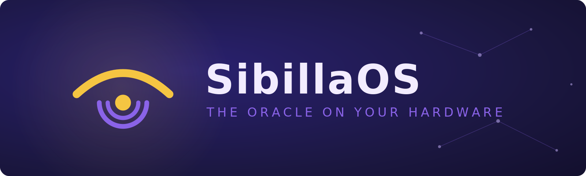
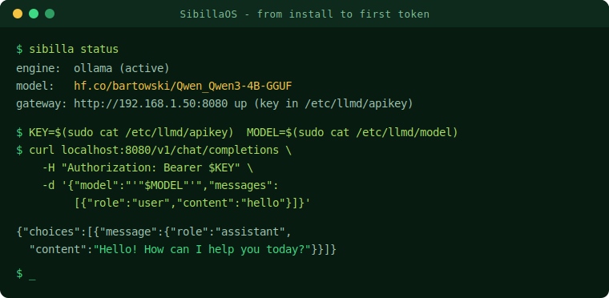
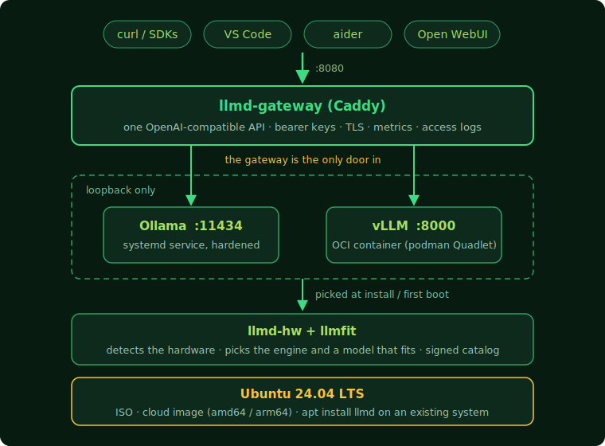

<div align="center">



<br/>

**Install Linux, get a working LLM API. Nothing else to set up.**

[](LICENSE)
[](https://ubuntu.com)
[](https://github.com/engineering87/sibillaos/actions/workflows/build-iso.yml)
[](https://github.com/engineering87/sibillaos/releases)
[](docs/architecture.md)

</div>

<br/>

<p align="center">

<br/>
<sub>Example session: the commands are exact, the output is representative.</sub>
</p>

<br/>

Running a local LLM still means picking an engine, matching a model to your VRAM, choosing a quantization and wiring up a service. SibillaOS does all of that for you. Boot the ISO, walk through the standard Ubuntu screens (locale, network, disk, your user), and the first thing your machine does after installing is serve an OpenAI-compatible API.

```console
$ curl http://myserver:8080/v1/chat/completions \
    -H "Authorization: Bearer $(sudo cat /etc/llmd/apikey)" \
    -d "{\"model\": \"$(sudo cat /etc/llmd/model)\", \"messages\": [{\"role\": \"user\", \"content\": \"hello\"}]}"
```

<br/>

## Quick start

Already on Ubuntu 24.04? You do not have to reinstall anything. Add the repository and turn the box into an LLM appliance:

```console
$ curl -fsSL https://engineering87.github.io/sibillaos/apt/sibillaos-archive-key.asc \
    | sudo gpg --dearmor -o /usr/share/keyrings/sibillaos-archive-keyring.gpg
$ printf 'Types: deb\nURIs: https://engineering87.github.io/sibillaos/apt/\nSuites: ./\nSigned-By: /usr/share/keyrings/sibillaos-archive-keyring.gpg\n' \
    | sudo tee /etc/apt/sources.list.d/sibillaos.sources
$ sudo apt update && sudo apt install llmd
$ sudo sibilla setup
```

`sibilla setup` detects the hardware, installs the engine if it is missing, pulls a fitting model and serves the API on port 8080. It is a good guest: it does not touch your firewall or your other package sources, and trying it is reversible: `sudo sibilla remove` takes out everything it installed, restores what it displaced and leaves the machine as it found it (CI verifies exactly that on every push).

For a whole machine or a VM from scratch, install one of the images instead. Two paths, both end at the same place.

**Cloud image (fastest, no USB).** Download the qcow2 for your architecture from [Releases](https://github.com/engineering87/sibillaos/releases), verify it against `SHA256SUMS-cloud-<arch>`, and boot it in your hypervisor with a cloud-init user-data that sets your user and SSH key, exactly as you would any Ubuntu cloud image.

**ISO (bare metal or VM).** Download the `.part` files and `SHA256SUMS` from Releases, reassemble and verify, write to a USB drive, boot it and pick "Install SibillaOS (automated)":

```console
$ cat sibillaos-*-amd64.iso.part* > sibillaos.iso
$ sha256sum -c SHA256SUMS
$ sudo dd if=sibillaos.iso of=/dev/sdX bs=4M status=progress
```

Either way, first boot detects the hardware, picks the engine and a fitting model, downloads it and brings up the API. Then, on the machine:

```console
$ sibilla status
engine:  ollama (active)
model:   hf.co/bartowski/Qwen_Qwen3-4B-GGUF
api:     http://192.168.1.50:8080 (key in /etc/llmd/apikey)

$ KEY=$(sudo cat /etc/llmd/apikey)
$ MODEL=$(sudo cat /etc/llmd/model)
$ curl http://localhost:8080/v1/chat/completions \
    -H "Authorization: Bearer $KEY" \
    -H "Content-Type: application/json" \
    -d "{\"model\": \"$MODEL\", \"messages\": [{\"role\": \"user\", \"content\": \"hello\"}]}"
```

From another machine, swap `localhost` for the address `sibilla status` prints and copy the key from `/etc/llmd/apikey`.

Where to go next:

- switch model: `sudo sibilla model use ID` (`sibilla model list` shows what fits your machine)
- HTTPS: `sudo sibilla tls enable myserver.lan` (add `--acme you@example.org` for a public hostname)
- editor and agent config: `sudo sibilla connect` (`--write` places the Continue config for you)
- chat interface: `sudo sibilla webui enable` (Open WebUI on port 3000)
- something wrong: `sudo sibilla doctor` produces a paste-ready report for your issue, secrets excluded

## How it works

The installer detects your hardware and makes the decisions a human would otherwise have to research.

| | |
|---|---|
| **Engine selection** | vLLM in an OCI container on datacenter GPUs (24 GB VRAM and up), Ollama everywhere else, CPU-only machines included. |
| **Model sizing** | [llmfit](https://github.com/AlexsJones/llmfit) recommends only models that actually fit your VRAM and RAM, with the best quantization and a speed estimate. |
| **Curated catalog** | Permissively licensed (Apache-2.0/MIT), non-gated Hugging Face repos only. Verified ids, signed list. |
| **Resilient download** | The model is pulled from Hugging Face during install and resumed at first boot if the connection drops. |
| **Single endpoint** | One OpenAI-compatible API on port 8080 with mandatory bearer tokens: multiple keys with per-key revocation (`sibilla key`), structured access logs. Engines stay on loopback. `sibilla tls enable HOSTNAME` switches the gateway to HTTPS (local CA, or Let's Encrypt with `--acme`). |
| **One CLI** | `sibilla status` is a health view of the whole stack: engine, served models, disk usage of the model store, GPU utilization, gateway reachability. |
| **Model management** | `sibilla model list` shows what fits your machine, `sibilla model use ID` downloads and switches the served model, `rm` and `prune` reclaim disk. |
| **Observability** | `sibilla metrics enable` serves Prometheus metrics behind the same API key; Grafana dashboard included in [docs/observability](docs/observability/). |
| **Chat interface** | `sibilla webui enable` starts Open WebUI on port 3000 as an opt-in container, wired to the local engine. |
| **Editor hookup** | `sibilla connect` prints ready-to-paste configuration for VS Code (Continue, Cline), aider and any OpenAI-compatible client. |

The base install is a headless server; a desktop variant is on the roadmap.

## Architecture at a glance

<p align="center"></p>

The engines never listen off-host: the gateway is the only door in. The full decision log is in [docs/architecture.md](docs/architecture.md).

## Building from source

Prebuilt images are the quick path above; to build your own you only need `xorriso` and `curl` (no root). The build downloads the official Ubuntu 24.04 live-server ISO, verifies its checksum and repacks it with the SibillaOS autoinstall, packages and branding:

```bash
sudo apt-get install xorriso
./packages/build-debs.sh       # build the llmd-* debs
./iso/build.sh                 # out/sibillaos-<version>-amd64.iso
```

Every push to `main` also builds the ISO in CI, boots it in QEMU and runs the automated install end to end; the image is attached to each run as an artifact.

Installed systems receive llmd package updates through the project's signed [APT repository](apt/README.md), preconfigured on every image: a plain `sudo apt update && sudo apt upgrade` keeps the stack current between reinstalls.

## Repository layout

```
iso/          ISO repack (official Ubuntu live-server + payload) and autoinstall
cloud/        qcow2 cloud image bake (official Ubuntu cloud image + payload)
packages/     Debian packages: hardware detection, engines, gateway, first boot
catalog/      curated model list (signed JSON)
branding/     logo, banner and wallpaper
docs/         architecture document
```

## Status

Working proof of concept: on every push, CI builds the ISO, boots it under BIOS and UEFI, runs the install end to end and gets a real chat completion through the gateway on first boot. Engine versions are pinned in the installer. Release ISOs walk you through the standard installer screens and you choose your own credentials; only the fully unattended CI images use a fixed test user. The design and decision log live in [docs/architecture.md](docs/architecture.md); where the project is going is in [ROADMAP.md](ROADMAP.md).

## Contributing

Contributions are welcome. [CONTRIBUTING.md](CONTRIBUTING.md) covers the build setup, the CI test suite your change has to pass, and the criteria for model catalog additions.

## License

Apache-2.0, see [LICENSE](LICENSE). Bundled components keep their own licenses: vLLM (Apache-2.0), Ollama (MIT), llmfit (MIT). NVIDIA drivers are not redistributed by this repository; the ISO installs them from the Ubuntu `restricted` component.
